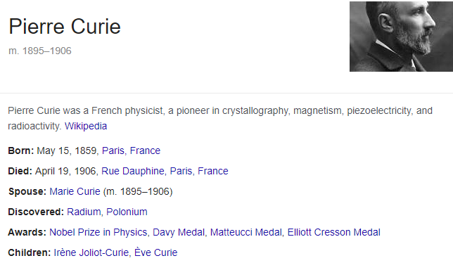
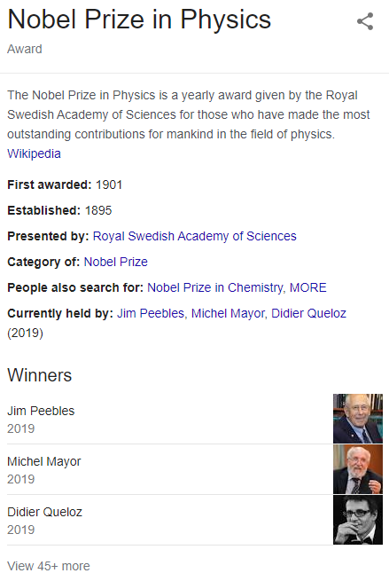
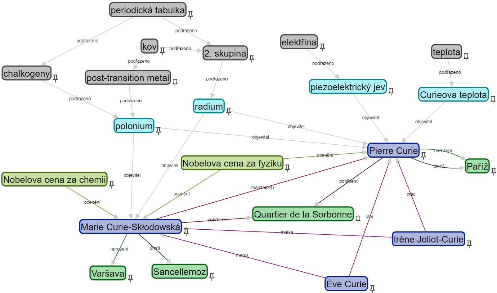
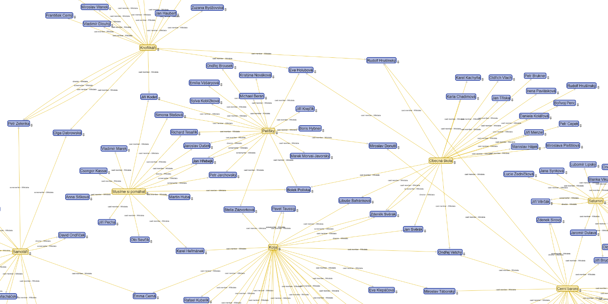
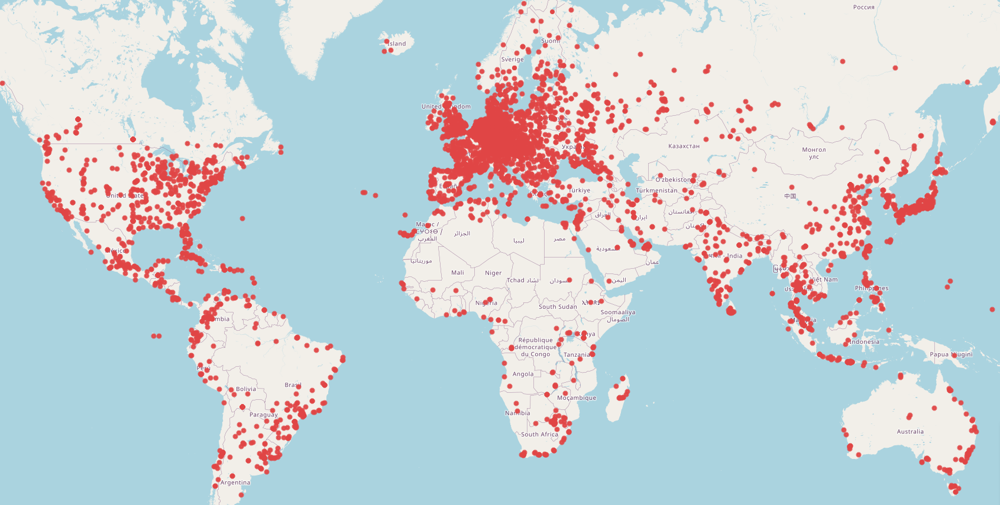
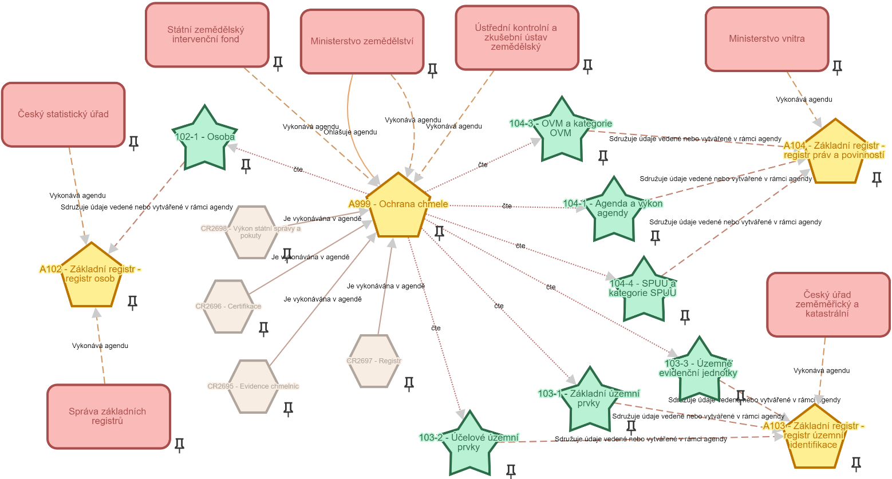

V květnu 2012 začal Google používat pojem *Knowledge Graph* (česky *znalostní graf*) pro označení svojí znalostní báze, kterou používá pro doplňování výsledků vyhledávání. Od té doby se pojem rozšířil do řady oblastí a zasáhl i do světa otevřených dat. V tomto seriálu si znalostní grafy představíme a podíváme se, jak lze s nimi strojově pracovat a jaké mohou najít uplatnění a dokonce jej již nachází ve světě otevřených dat.
<!--more-->

## Co je znalostní graf?

Začali jsme u Googlu a ještě u něj chvíli zůstaneme. Znalostní báze, pro kterou Google v květnu 2012 použil pojem znalostní graf, je tvořena záznamy, které popisují entity reálného světa jako jsou např. osoby nebo místa, a vztahy mezi entitami jako např. vztah mezi manželi či rodiči a jejich dětmi. Při používání vyhledávače Google se můžete na znalostní graf Google snadno podívat. Zkuste v anglické verzi vyhledávače Google zadat dotaz *'Husband of Marie Curie'* (bohužel česká verze Google nepřipojuje k výsledkům vyhledávání výpis ze znalostního grafu). Kromě webových stránek spojených se zadaným vyhledávacím dotazem uvidíte i strukturovanou informaci o Pierrovi Curie, manželovi Marie Curie, zobrazenou na následujícím obrázku.

V zobrazeném strukturovaném výsledku vidíte údaje o Pierrovi Curie a také odkazy na související entity. Např. na jeho manželku, děti, objevy nebo ocenění, které získal. Na vybranou entitu lze kliknout a získat strukturované zobrazení jejích údajů včetně dalších vztažených entit tak, jak jsou reprezentovány ve znalostním grafu Google. Např. si můžeme vybrat *Nobelovu cenu za fyziku* a tak se vlastně ve znalostním grafu přesunout na jiné místo.

Pohledy na entity, které jsme viděli, a přechod z jedné entity na druhou prostřednitvím souvislosti mezi nimi, nás přibližuje k významu slova *graf*. Nemá význam ve smyslu např. sloupcového nebo koláčového diagramu, který používáme pro vizualizaci statistických ukazatelů. Znamená datovou strukturu pocházející ze světa matematiky označovanou také pojmem *graf*. Matematický graf je tvořen *uzly*, které jsou propojeny *hranami*. Znalostní graf reprezentuje každou entitu reálného světa právě jako uzel v grafu. Vztahy mezi entitami jsou pak reprezentovány jako hrany v grafu. Hrany jsou označeny názvem reprezentovaného vztahu. Informace, kterou ukazují předchozí obrázky z výsledků vyhledávání na anglickém Google, jsou tak ve skutečnosti reprezentovány ve struktuře matematického grafu podobné té zobrazené na následujícím obrázku.

Na obrázku vidíme uzly grafu, které reprezentují entity reálného světa. Uzly zobrazené modře reprezentují osoby. Tmavě zelené uzly reprezentují místa spojená se životem těchto osob. Světle zelené uzly reprezentují ocenění získaná osobami. Světle modré uzly jsou pak jejich objevy a šedé uzly reprezentují kategorie, do kterých tyto objevy patří. Hrany zobrazené jako šipky pak reprezentují souvislosti mezi entitami. Např. vidíme, že Pierre je manželem Marie nebo že Marie je matkou Ève.

Podstatou reprezentace dat v podobě znalostního grafu je to, že uzly a hrany mezi nimi jsou primární datovou strukturou, ve které jsou data poskytována a zpracovávána. Entita je reprezentována jako uzel grafu a má globální (celosvětový) identifikátor. Libovolné tvrzení o entitě (hodnotu její vlastnosti nebo vztah s jinou entitou) můžeme reprezentovat jako hranu navázanou na tento globální identifikátor. Je pak dokonce možné, že v několika různých znalostních grafech reprezentujeme tvrzení o stejné entitě prostřednictvím jejího identifikátoru. V dalších dílech tohoto seriálu popíšeme, jak toto zařídit technicky. Není podstatné, jak jsou data znalostního grafu interně uložena. Mohou být klidně uložena v relační databázi nebo jakékoliv jiné strukturované databázi. Podstatné je, že s daty potom pracujeme jako s grafem.

## Jiné znalostní grafy

V roce 2012 byl pojem znalostní graf chápán jako ekvivalent znalostního grafu Google. V posledních letech se ale ujal jako obecnější označení znalostních bází reprezentovaných ve strukturované strojově zpracovatelné podobě matematického grafu. Ujal se pro reprezentaci znalostí v podnikových prostředích i v prostředí otevřených dat.

V prostředí otevřených dat je v současnosti nejvýraznějším znalostním grafem obsah vytvářený v rámci komunitního projektu [Wikidata][link_wikidata]. Jedná se o jeden z [projektů][link_wikimedia_projects] [Wikimedia Foundation][link_wikimedia_foundation]. Znalostní graf Wikidata není doménově zaměřen. Kdokoliv může do znalostního grafu vložit jakékoliv údaje o jakékoliv entitě. Ve skutečnosti obrázek znalostního grafu o Marii a Pierrovi Curie uvedený výše v tomto článku nebyl vygenerován z obsahu znalostního grafu Google, ale právě z obsahu znalostního grafu Wikidata. Znalostní graf Google nemá veřejně dostupné API pro jeho rozumné zpracování (nejedná se o veřejně dostupný datový zdroj). Naopak znalostní graf Wikidata je plně veřejně dostupný prostřednictvím [strojového API][link_wikidata_qs], které umožňuje přistupovat ke znalostnímu grafu s použitím grafového dotazovacího jazyka [SPARQL][link_sparql]. Tomuto jazyku budeme věnovat samostatný díl našeho seriálu. Nyní se spokojme s tím, že SPARQL je pro grafová data něco jako je jazyk SQL pro data relační. Nad znalostním grafem Wikidata se můžete pomocí dotazovacího jazyka SPARQL libovolně dotazovat, např. si můžete zjistit datumy objevů všech chemických prvků a zobrazit si je na [časové ose objevů](https://w.wiki/Q$$) (časovou osu si v místě velké hustoty objevů roztáhněte stiskem klávesy CTRL a točením kolečka myši, příp. roztažením prstů na obrazovce vašeho mobilu).

Široké zaměření znalostního grafu Wikidata umožňuje celou škálu pohledů. Následující obrázek je např. pohledem na 8 vybraných českých filmů a lidi, kteří se podíleli na jejich tvorbě jako herci, režiséři či scénáristé.

Existují i další iniciativy, ve kterých vznikají znalostní grafy. Wikidata není jediným veřejně dostupným znalostním grafem, který není doménově zaměřen. Mezi další obecné veřejné znalostní grafy patří např. znalostní graf [DBpedia][link_dbpedia], který je vytvářen vytěžováním strukturovaných dat z Wikipedie, nebo znalostní graf [KBpedia][link_kbpedia], který integruje jiné znalostní grafy, mimo jiné i Wikidata a DBpedia. Do kategorie obecných znalostních grafů patří také geografické znalostní grafy, které reprezentují místa na mapě v podobě znalostního grafu. Z této oblasti zmiňme zajímavý znalostní graf [Sophox][link_sophox], který zpřístupňuje obsah známé databáze [OpenStreetMap][link_osm] jako znalostní graf.

Jak uvidíme v dalších částech tohoto seriálu, výhodou znalostních grafů je snadnost jejich vzájemného propojování. Často již dokonce propojené jsou. Zde si uveďme pouze jednoduchý příklad využívající propojení znalostního grafu OpenStreetMap Sophox se znalostním grafem Wikidata. Příklad zobrazuje na mapě všechny zoologické zahrady světa podle databáze OpenStreetMap a jejich fotografie uváděné ve znalostním grafu Wikidata. Můžete si jej [pustit naživo][zoo], ale chvíli to bude trvat, protože se bude nějakou dobu počítat. Můžete si pak zkusit najít např. Zoologickou zahradu hl. m. Prahy.

Existují i doménově zaměřené znalostní grafy. Např. v oblasti bioinformatiky vznikaly znalostní grafy ještě dříve, než byl pojem znalostních grafů zaveden. Následujcí seznam uvádí několik příkladů volně dostupných znalostních grafů z této oblasti:

 * [Medical Subject Headings (MeSH)][link_mesh] je řízený slovník medicínských pojmů, který se používá pro anotaci medicínských publikací.
 * [National Cancer Institute Thesaurus (NCIt)][link_nci_thesaurus] je řízený slovník pojmů v oblasti klinické péče a základního výzkumu nejen v oblasti rakoviny
 * [Gene Ontology][link_gene_ontology] obsahuje reprezentaci současného vědeckého poznání o funkcích genů
 * [Universal Protein Resource (UniProt)][link_uniprot] obsahuje vědecká data o proteinech
 * [FoodOn][link_foodon] obsahuje informace o jídle, jeho složení, kulturním původu nebo o jeho výrobních procesech

Znalostní grafy jsou v posledních letech oblíbené také v oblasti kultury a muzejnictví. Opět uvedeme několik příkladů.

 * [Smithsonian American Art Museum][link_saam] zpřístupňuje metadatovou znalostní bázi o umělcích a uměleckých dílech jako znalostní graf
 * [Rijksdienst voor het Cultureel Erfgoed][link_rce], holandská státní agentura kulturního dědictví zpřístupňuje metadata o holandském kulturním dědictví jako znalostní graf
 * [Europeana][link_europeana] sdružuje metadata o evropském kulturním dědictví z evropských muzeí, galerií, knihoven a acrhivů a zpřístupňuje je i v podobě znalostního grafu
 * [Getty Research Institute][link_getty] zpřístupňuje v podobě znalostního grafu strukturované slovníky a data o umění a architetuře
 * [Linked Jazz][link_linkedjazz] reprezentuje jazzovou historii jako znalostní graf

Znalostní grafy z příkladů výše jsou poskytovány jako otevřená data, tj. pod svobodnými podmínkami užití ve strojově čitelných a otevřených formátech. Poskytovat otevřená data v podobě znalostního grafu sice není ještě zcela běžné, ale počet příkladů roste a především díky znalostním grafům, jako jsou [Wikidata][link_wikidata], [DBpedia][link_dbpedia] nebo [Sophox][link_sophox] zajímavě roste i množství dat dostupných v této podobě.

## Znalostní grafy a otevřená data veřejné správy ČR

Možná se ptáte, zda existují nějaké znalostní grafy také v češtině nebo o entitách spojených s naší zemí. Obecné znalostní grafy [Wikidata][link_wikidata], [DBpedia][link_dbpedia] a [Sophox][link_sophox] popsané výše obsahují i údaje o "českých" entitách a jsou tvořeny českou komunitou, která je v tvorbě takových otevřených datových zdrojů poměrně aktivní.

Portál, na kterém se nacházíte, se ale věnuje otevřeným datům veřejné správy ČR. Existují tedy nějaká otevřená data veřejné správy ČR poskytovaná v podobě znalostních grafů? Abychom mohli data poskytovaná veřejnou správou ČR nazývat otevřená, nestačí aby byla poskytována pod svobodnými podmínkami užití a ve strojově čitelném a otevřeném formátu. Musí být navíc katalogizována v [Národním katalogu otevřených dat][link_nkod]. A právě v něm lze najít dva znalostní grafy.

Prvním jsou [datové sady zpřístupňující veřejná data registru práv a povinností][link_nkod_rpp]. Registr práv a povinností je jedním ze čtyř [základních registrů veřejné správy ČR](https://www.mvcr.cz/clanek/zakladni-registry-a-sprava-zakladnich-registru.aspx). Eviduje údaje o orgánech veřejné moci (např. úřadech) a o tom, co dělají. To, co dělají, je evidováno v podobě agend, které se skládají z činností. V rámci těchto činností orgány veřejné moci využívají údaje jiných orgánů veřejné moci, což je v registru práv a povinností též evidováno.

Pokud se na [datové sady registru práv a povinností][link_nkod_rpp] podíváte podrobněji, zjistíte, že jsou vedle formátu JSON poskytovány ve formátu [JSON-LD][link_jsonld]. Vyberete-li si některou z JSON-LD distribucí datových sad z registru práv a povinností a podíváte se na její obsah, zjistíte, že v ní jsou uváděna URL, která identifikují entity, o kterých jsou v datové sadě uváděny údaje. Toto je standardní způsob poskytování otevřených dat v podobě znalostního grafu. Těmto technickým aspektům se ale budeme konkrétněji věnovat až v pozdějších dílech našeho seriálu.

Zkusme se teď jenom namátkou na nějaký uzel znalostního grafu registru práv a povinností podívat. Tak např. v datové sadě Agend můžeme vidět agendu s názvem *"Ochrana chmele"*. Má přiřazeno URL [`https://rpp-opendata.egon.gov.cz/odrpp/zdroj/agenda/A999`][A999], které je uvedeno jako odkaz. Zkuste na něj kliknout a dostanete se na lidsky čitelný výpis uzlu reprezentujícího agendu ve znalostním grafu registru práv a povinností. Z něj se můžete prostým klikáním posouvat na další uzly grafu, které jsou na uzel agendy napojeny pomocí hran. Takové procházení nemusí být přehledné. Pro lepší představu o okolí agendy *"Ochrana chmele"* si okolí vizualizujme na následujícím obrázku.

Červené obdelníky s kulatými rohy reprezentují orgány veřejné moci. Žluté pětiúhelníky reprezentují agendy. Světle hnědé šestiúhelníky reprezentují činnosti v rámci agendy. Zelené hvězdy potom reprezentují údaje, které orgán veřejné moci čte při výkonu agendy z jiných agend. Obrázek nám tak např. ukazuje, že úřady vykonávající agendu *"Ochrana chmele"* čtou při výkonu jejich činnosti údaje o osobách ze základního registru osob. Osobami v základním registru nejsou občané, ale subjekty, kterým bylo přiděleno IČ. Jedná se tak zjednodušeně řečeno o právnické a podnikající fyzické osoby.

Druhým znalostním grafem, který můžeme v Národním katalogu otevřených dat najít, je zlatostní graf popisující jeho samotný obsah, tj. katalogizační záznamy v něm vedené. Obsah Národního katalogu otevřených dat je v Národním katalogu otevřených dat katalogizován jako [jedna datová sada][nkod_znalostní_graf]. Údaje datové sady jsou reprezentovány dle evropského standardu [DCAT-AP][link_dcatap], který požaduje reprezentaci katalogizačních záznamů právě v podobě znalostního grafu.

Zkusme se podívat, jak jsou jednotlivé katalogizační záznamy evidované v Národním katalogu otevřených dat reprezentovány ve znalostním grafu. Není k tomu potřeba stahovat datovou sadu s obsahem Národního katalogu otevřených dat. Využijeme jednoduchého systému URL. Zkuste si v Národním katalogu otevřených dat najít datovou sadu [*"Volby do Poslanecké sněmovny Parlamentu ČR 2017 - celkové výsledky za ČR a kraje"*][volby_do_PS]. Vedle názvu datové sady na stránce s jejím detailem uvidíte symbol odkazu, viz následující obrázek.

Klikněte na tento symbol. Dostanete se na lidsky čitelný výpis uzlu reprezentujícího datovou sadu ve znalostním grafu Národního katalogu otevřených dat. Podobně jako v předchozích příkladech můžete od tohoto místa začít znalostní graf procházet. Opět můžeme znalostní graf i vizualizovat. Např. následující obrázek ukazuje vizualizaci pro zvoleného poskytovatele, *Český statistický úřad* datové katalogy, ve kterých katalogizuje svoje datové sady.

Výše byla zmiňována výhoda znalostních grafů - snadnost kombinace různých znalostních grafů dohromady. Znalostní graf Národního katalogu otevřených dat propojuje uzly reprezentující poskytovatele otevřených dat, např. *Český statistický úřad*, na uzly, které je reprezentují ve znalostním grafu *registru práv a povinností*. Tím je obohacuje o všechny údaje, které k nim jsou vedeny v registru práv a povinností. Obohacení je provedeno jednoduchým odkazem mezi znalostními grafy. Jak takový odkaz a jeho možná využití technicky vypadají, si řekneme v následujících dílech tohoto seriálu. Na posledním obrázku se můžete také podívat na možné využití propojení dvou znalostních grafů, kdy vedle *Českého statistického úřadu* vidíme údaje z obou znalostních grafů. Ze znalostního grafu Národního katalogu otevřených dat vidíme katalogy, ve kterých úřad katalogizuje svoje datové sady a ze znalostního grafu registru práv a povinností vidíme, jaké agendy vykonává.

## Závěr

Tento článek slouží jako úvod do světa znalostních grafů. Ukázali jsme si na skutečných příkladech, co je to znalostní graf. Představili jsme si také dva příklady znalostních grafů publikovaných jako otevřená data poskytovateli z řad českých úřadů. Zatím jsme si ukazovali pouze základní myšlenky a jejich demonstrace v podobě obrázků vygenerovaných ze znalostních grafů. V dalších dílech seriálu se budeme následně věnovat technickým aspektům znalostních grafů - jak je reprezentovat, jak je vytvářet a jak s nimi pracovat. Speciální díly také věnujeme práci se dvěma znalostními grafy zmíněnými na konci tohoto článku, tj. znalostnímu grafu registru práv a povinností a znalostnímu grafu Národního katalogu otevřených dat.

[link_wikidata]: https://wikidata.org "Wikidata"
[link_wikidata_qs]: https://query.wikidata.org/ "Wikidata Query Service"
[link_wikimedia_foundation]: https://wikimediafoundation.org/ "Wikimedia Foundation"
[link_wikimedia_projects]: https://wikimediafoundation.org/our-work/wikimedia-projects/ "Wikimedia projects"
[link_sparql]: https://www.w3.org/TR/sparql11-query/ "SPARQL"
[link_dbpedia]: https://wiki.dbpedia.org/ "DBpedia"
[link_kbpedia]: https://kbpedia.org/ "KBpedia"
[link_sophox]: https://wiki.openstreetmap.org/wiki/Sophox "Sophox"
[zoo]: (https://sophox.org/embed.html#PREFIX%20wdt%3A%20%3Chttp%3A%2F%2Fwww.wikidata.org%2Fprop%2Fdirect%2F%3E%0A%23defaultView%3AMap%0ASELECT%20%3Fzoo%20%3Fname%20%3Floc%20%3Fzoowd%20%3Fimage%0AWHERE%20%7B%0A%20%20%20%3Fzoo%20osmt%3Atourism%20%22zoo%22%3B%0A%20%20%20%20%20%20osmm%3Aloc%20%3Floc%20%3B%0A%20%20%20%20%20%20osmt%3Aname%20%3Fname%20.%0A%20%20%20OPTIONAL%20%7B%0A%20%20%20%20%20%3Fzoo%20osmt%3Awikidata%20%3Fzoowd%20.%0A%20%20%20%20%20SERVICE%20%3Chttps%3A%2F%2Fquery.wikidata.org%2Fsparql%3E%20%7B%0A%20%20%20%20%20%20%20%3Fzoowd%20wdt%3AP18%20%3Fimage%0A%20%20%20%20%20%7D%0A%20%20%20%7D%0A%7D) "Zoologické zahrady"
[link_osm]: https://wiki.openstreetmap.org/ "OpenStreetMap"
[link_gene_ontology]: http://geneontology.org/ "Gene Ontology"
[link_nci_thesaurus]: https://ncit.nci.nih.gov/ncitbrowser/pages/home.jsf?version=20.05a "NCI Thesaurus"
[link_mesh]: https://www.nlm.nih.gov/mesh/meshhome.html "Medical Subject Headings"
[link_uniprot]: https://www.uniprot.org/ "UniProt"
[link_foodon]: https://foodon.org/ "FoodOn"
[link_linkedjazz]: https://linkedjazz.org/network/ "Linked Jazz"
[link_saam]: https://americanart.si.edu/about/lod "Smithsonian American Art Museum"
[link_rce]: https://linkeddata.cultureelerfgoed.nl/home "Rijksdienst voor het Cultureel Erfgoed"
[link_europeana]: https://pro.europeana.eu/page/sparql "Europeana"
[link_getty]: http://vocab.getty.edu/ "Getty"
[link_nkod]: https://data.gov.cz/ "Národní katalog otevřených dat"
[link_nkod_rpp]: https://data.gov.cz/datové-sady?klíčová%20slova=registr%20práv%20a%20povinností "Datové sady registru práv a povinností"
[link_jsonld]: https://json-ld.org/ "JSON-LD"
[A999]: https://rpp-opendata.egon.gov.cz/odrpp/zdroj/agenda/A999 "Ageda 999"
[NKOD_znalostní_graf]: https://data.gov.cz/datová-sada?iri=https%3A%2F%2Fdata.gov.cz%2Fzdroj%2Fdatové-sady%2FMV%2F670509543 "NKOD znalostní graf"
[link_dcatap]: https://joinup.ec.europa.eu/solution/dcat-application-profile-data-portals-europe "DCAT-AP"
[volby_do_PS]: https://data.gov.cz/datová-sada?iri=https%3A%2F%2Fdata.gov.cz%2Fzdroj%2Fdatové-sady%2Fhttp---vdb.czso.cz-pll-eweb-package_show-id-ps2017vysledky "Volby do PS"